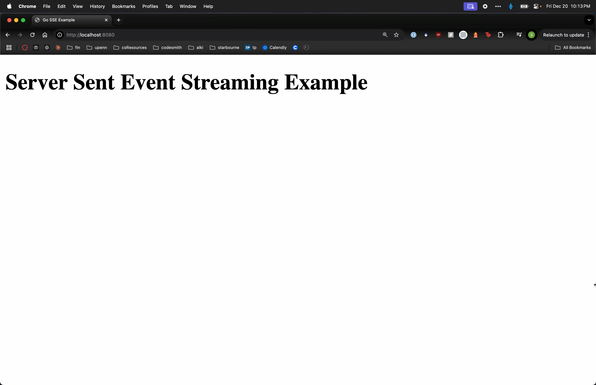

# go-sse-ex

Example of server-sent events (SSE) using Go and vanilla JS

<p align="center">
  
</p>

## Installation

- Go (Download from [golang.org](https://golang.org))

## Running the Application

Run the Go server:

```bash
go run main.go
```

Navigate to `http://localhost:8080`

## How it works

Server implements two main endpoints:

- `/` - Serves static HTML files
- `/events` - Handles SSE stream and sends words one at a time

Frontend uses `EventSource` api to connect to SSE stream and display incoming words in real-time
